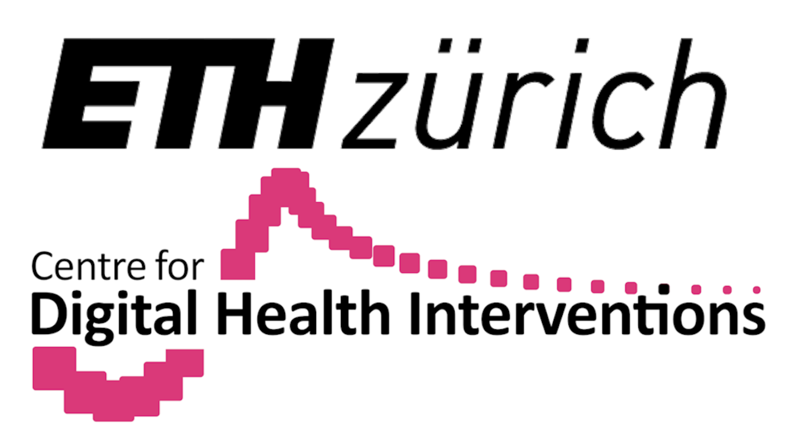
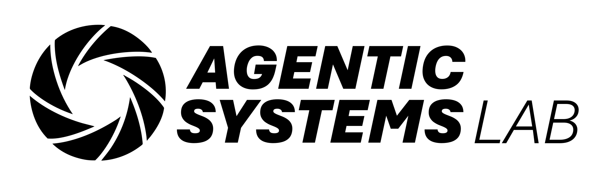

<!--
This source file is part of the OpenTSLM open-source project

SPDX-FileCopyrightText: 2025 Stanford University, ETH Zurich, and the project authors (see CONTRIBUTORS.md)

SPDX-License-Identifier: MIT
-->

# OpenTSLM: Time-Series Language Models for Reasoning over Multivariate Medical Text- and Time-Series Data
[](https://doi.org/10.13140/RG.2.2.14827.60963)
[](https://github.com/StanfordBDHG/OpenTSLM/actions/workflows/static-analysis.yml)


Large Language Models (LLMs) have emerged as powerful tools for interpreting multimodal data (e.g., images, audio, text), often surpassing specialized models. In medicine, they hold particular promise for synthesizing large volumes of clinical information into actionable insights and patient-facing digital health applications.  Yet, a major limitation remains their inability to handle time series data. To overcome this gap, we present OpenTSLM, a family of Time Series Language Models (TSLMs) created by integrating time series as a native modality to pretrained Large Language Models, enabling natural-language prompting and reasoning over multiple time series of any length [...] **[🔗 Read the full paper](https://doi.org/10.13140/RG.2.2.14827.60963)**  

<p align="center">
  
</p>


## Examples

OpenTSLM models can reason over multiple time series of any length at once, generating findings, captions, and rationales in natural language. We tested these models across a wide range of tasks spanning Human Activity Recognition (HAR) from 3-axis acceleration data, sleep staging from EEG readings, 12-lead ECG question answering, and time series captioning. Some examples are shown below, more are available in the paper.

<p align="center">
  
  
    

</p>


## Installation

1. **Clone the Repository**

   ```bash
   git clone https://github.com/StanfordBDHG/OpenTSLM.git --recurse-submodules
   ```

2. **Install Dependencies**
   ```bash
   pip install -r requirements.txt
   ```


## LLM Setup

OpenTSLM is designed to work with Llama and Gemma models, with Llama 3.2 1B as the default. These models are stored in Hugging Face repositories which may require access permissions. Follow these steps to gain access and download:

1. **Request Access (for Llama models)**  
   Visit the Llama model repository (e.g., https://huggingface.co/meta-llama/Llama-3.2-1B) or Gemma models repository (https://huggingface.co/google/gemma-3-270m) and request access from Meta.

2. **Authenticate with Hugging Face**  
   Log in to your Hugging Face account and configure the CLI:

   ```bash
   huggingface-cli login
   ```

3. **Create an API Token**
   - Go to your Hugging Face settings: https://huggingface.co/settings/tokens
   - Generate a new token with `read` scope.
   - Copy the token for CLI login.

### Supported Models

OpenTSLM has been tested and works with the following models:

**Llama Models:**

- **meta-llama/Llama-3.2-1B** (default)
- **meta-llama/Llama-3.2-3B**

**Gemma Models:**

- **google/gemma-3-270m**
- **google/gemma-3-1b-pt**

Other variants may work but have not been extensively tested.


## Multi-stage training (Curriculum)

OpenTSLM uses curriculum learning with progressive training stages:

### Training Stages

1. **Stage 1 (MCQ)**: Multiple choice questions on time series data (TSQA dataset)
2. **Stage 2 (Captioning)**: Generate detailed captions for time series (M4 dataset)
3. **Stage 3 (CoT)**: Chain-of-thought reasoning on human activity recognition (HAR dataset)
4. **Stage 4 (Sleep CoT)**: Chain-of-thought reasoning on sleep stage classification (SleepEDF dataset)
5. **Stage 5 (ECG CoT)**: Chain-of-thought reasoning on ECG question answering (ECG QA dataset)

> **⚠️ MPS/CUDA Compatibility Warning:**
>
> If you are using Apple's MPS (Metal Performance Shaders) backend (e.g., on Mac with Apple Silicon), you may encounter issues with training or inference. **Checkpoints trained with CUDA (NVIDIA GPUs) may not yield good results or may not be fully compatible when loaded and run on MPS.** For best results, use the same device type (CUDA or MPS) for both training and inference. CUDA is preferred in general.

### Quick Start

```bash
# Run full curriculum with OpenTSLMFlamingo
python curriculum_learning.py --model OpenTSLMSP

# Run full curriculum with OpenTSLMSP
python curriculum_learning.py --model OpenTSLMFlamingo

# Run specific stages
python curriculum_learning.py --model OpenTSLMFlamingo --stages stage1_mcq
python curriculum_learning.py --model OpenTSLMFlamingo --stages stage2_captioning
python curriculum_learning.py --model OpenTSLMFlamingo --stages stage3_cot
python curriculum_learning.py --model OpenTSLMFlamingo --stages stage4_sleep_cot
python curriculum_learning.py --model OpenTSLMFlamingo --stages stage5_ecg_cot

# Run multiple stages
python curriculum_learning.py --model OpenTSLMFlamingo --stages stage1_mcq stage2_captioning stage3_cot

# Specify device
python curriculum_learning.py --model OpenTSLMFlamingo --device cuda

# Use different models
python curriculum_learning.py --model OpenTSLMFlamingo --llm_id meta-llama/Llama-3.2-1B
python curriculum_learning.py --model OpenTSLMFlamingo --llm_id google/gemma-3-270m

# Run only evaluation
python curriculum_learning.py --model OpenTSLMFlamingo --eval_only
```

### Command Line Arguments

- `--model`: Model type (`OpenTSLMSP` or `OpenTSLMFlamingo`)
- `--stages`: Stages to run (any combination of: `stage1_mcq`, `stage2_captioning`, `stage3_cot`, `stage4_sleep_cot`, `stage5_ecg_cot`)
- `--device`: Device to use (`cuda`, `mps`, `cpu`)
- `--eval_only`: Run evaluation only (requires an existing checkpoint for the stage)
- `--llm_id`: Model ID (default: `meta-llama/Llama-3.2-1B`, supports Llama and Gemma models)
- `--batch_size`: Batch size for training
- `--gradient_checkpointing`: Enable gradient checkpointing for memory efficiency
- `--verbose`: Enable verbose logging


## 📁 Results Structure

During training, the script creates a structured results directory:

```
results/
├── {llm_id}/
│   ├── OpenTSLMSP/
│   │   ├── stage1_mcq/
│   │   │   ├── checkpoints/
│   │   │   │   ├── best_model.pt
│   │   │   │   └── loss_history.txt
│   │   │   └── results/
│   │   │       ├── test_predictions.jsonl
│   │   │       └── metrics.json
│   │   ├── stage2_captioning/
│   │   │   ├── checkpoints/
│   │   │   │   ├── best_model.pt
│   │   │   │   └── loss_history.txt
│   │   │   └── results/
│   │   │       ├── test_predictions.jsonl
│   │   │       └── metrics.json
│   │   ├── stage3_cot/
│   │   │   ├── checkpoints/
│   │   │   │   ├── best_model.pt
│   │   │   │   └── loss_history.txt
│   │   │   └── results/
│   │   │       ├── test_predictions.jsonl
│   │   │       └── metrics.json
│   │   ├── stage4_sleep_cot/
│   │   │   ├── checkpoints/
│   │   │   │   ├── best_model.pt
│   │   │   │   └── loss_history.txt
│   │   │   └── results/
│   │   │       ├── test_predictions.jsonl
│   │   │       └── metrics.json
│   │   ├── stage5_ecg_cot/
│   │   │   ├── checkpoints/
│   │   │   │   ├── best_model.pt
│   │   │   │   └── loss_history.txt
│   │   │   └── results/
│   │   │       ├── test_predictions.jsonl
│   │   │       └── metrics.json
│   │   └── curriculum_results.json
│   └── OpenTSLMFlamingo/
│       ├── stage1_mcq/
│       ├── stage2_captioning/
│       ├── stage3_cot/
│       ├── stage4_sleep_cot/
│       ├── stage5_ecg_cot/
│       └── curriculum_results.json
```

Each stage automatically loads the best model from the previous stage, ensuring proper curriculum progression. Results are organized by model ID (sanitized), then by model type and stage. The `{llm_id}` directory name is derived from the `--llm_id` parameter (e.g., `meta-llama/Llama-3.2-1B` becomes `Llama3_2_1B`, `google/gemma-3-1b-pt` becomes `gemma_3_1b_pt`).


## Authors

This work was made possible through the collaborative efforts of an interdisciplinary team of researchers from computer science, medicine, and engineering. Thank you to all of the Co-authors of the TSLM publication:
- Patrick Langer (Stanford University, ETH Zurich, ETH Agentic Systems Lab)
- Thomas Kaar (Stanford University, TUM, ETH Agentic Systems Lab)
- Max Rosenblattl (Stanford University, TUM, ETH Agentic Systems Lab)
- Maxwell A. Xu (Google Research, University of Illinois Urbana-Champaign)
- Winnie Chow (Stanford University)
- Martin Maritsch (Amazon)
- Aradhana Verma (Stanford University)
- Brian Han (Stanford University)
- Daniel Seung Kim (University of Washington)
- Henry Chubb (Stanford University)
- Scott Ceresnak (Stanford University)
- Aydin Zahedivash (Stanford University)
- Alexander Tarlochan Singh Sandhu (Stanford University)
- Fatima Rodriguez (Stanford University)
- Daniel McDuff (Google Research, University of Washington)
- Elgar Fleisch (ETH Zurich, University of St. Gallen)
- Oliver Aalami (Stanford University)
- Filipe Barata (ETH Zurich)
- Paul Schmiedmayer (Stanford University)

## Contributing

Contributions to this project are welcome. Please make sure to read the [contribution guidelines](https://github.com/StanfordBDHG/.github/blob/main/CONTRIBUTING.md) and the [contributor covenant code of conduct](https://github.com/StanfordBDHG/.github/blob/main/CODE_OF_CONDUCT.md) first.

You can find a list of all current contributors at [CONTRIBUTORS.md](CONTRIBUTORS.md).


## Research Opportunities

Are you a student interested in advancing the frontiers of time-series language models and digital health research? We welcome students to get involved in our research projects!

Visit our [Student Research Opportunities page](http://bdh.stanford.edu/studentresearch) to learn more about current projects and how you can contribute to cutting-edge research at the intersection of AI and healthcare.

For researchers and project partners interested in collaboration opportunities, please reach out to us at **digitalhealthresearch@stanford.edu**.


## License

This project is licensed under the MIT License.

<div align="left">
  &nbsp;&nbsp;&nbsp;&nbsp;&nbsp;&nbsp;&nbsp;&nbsp;&nbsp;&nbsp;&nbsp;&nbsp;&nbsp;&nbsp;
  
    

</div>
